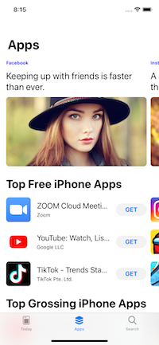

#  README

A simple app to show case a professional UIKit-based app.

This project has been inspired by **Brian Voong**'s sample app in his paid course: [App Store JSON APIs](https://www.letsbuildthatapp.com/course/AppStore%20JSON%20APIs).

Although the idea has been borrowed from his sample app, this project includes a huge number of improvements and additions, such as:

- a true clean architecture,
- unit and integration tests,
- configuration of a CI pipeline,
- dependency injection,
- implementation of cross-cutting concerns,
- localization of text literals,
- ...and much more.

(WORK IN PROGRESS)
